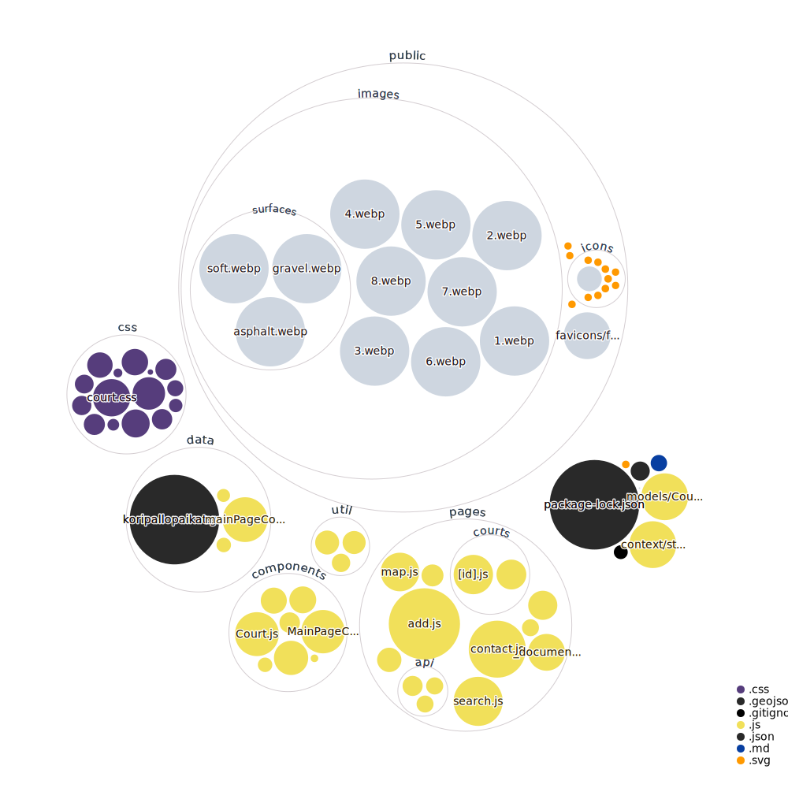

## App live on [Vercel](https://koripallopaikat.com)


### Made with:

- [Next.js](https://nextjs.org/)
- [Material UI](https://material-ui.com/)
- [MongoDB](https://www.mongodb.com/)
- [Mapbox GL JS](https://www.mapbox.com/mapbox-gljs)
- [React Hook Form](https://react-hook-form.com/)
- [SendGrid](https://sendgrid.com/)
- [OpenMoji](https://openmoji.org/)
- [kbar](https://github.com/timc1/kbar)

### Run locally

```bash
npm install
npm run dev

# or

yarn install
yarn dev
```

Your app should be up and running on [http://localhost:3000](http://localhost:3000)


